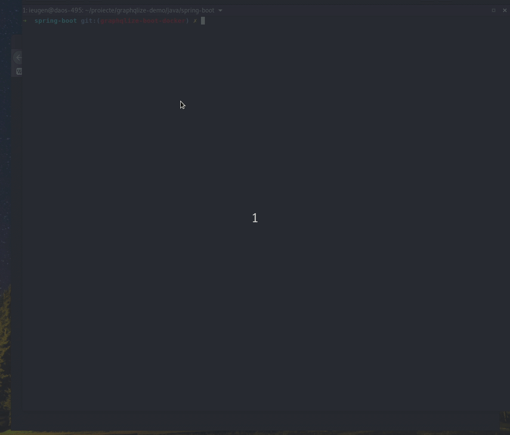

# graphqlize-demo

Demo applications developed using [GraphQLize](https://www.graphqlize.org)

## Getting Started Guides

Getting started with GraphQLize is simple and involves only a few steps.

1. Add the GraphQLize dependency in your project.
2. Initialize GraphQLize Resolver by providing the Java SQL [data source](https://docs.oracle.com/javase/7/docs/api/javax/sql/DataSource.html).
3. Add a GraphQL API endpoint and use the initialized GraphQlize Resolver in the previous step.

The actual implementation of these steps will vary based on which language (Java, Clojure) and framework (Spring Boot, Spark Java, Pedestal, etc.). Please refer the below links for more details.

- Java

  - [Spring Boot](http://graphqlize.org/docs/getting_started/java/springboot)
  - [Spark Java](http://graphqlize.org/docs/getting_started/java/sparkjava)
  - [Vanilla Java](https://www.graphqlize.org/docs/getting_started/java/vanilla)

- Clojure
  - [Pedestal](https://www.graphqlize.org/docs/getting_started/clojure/pedestal)
  - [Ring](https://www.graphqlize.org/docs/getting_started/clojure/ring)
  - [Vanilla Clojure](https://www.graphqlize.org/docs/getting_started/clojure/vanilla)

### Getting started with Docker

Some examples include docker and docker-compose files to get you started faster.

They will allow you to play around with the API generated by graphqlize over a sample database or your own.

